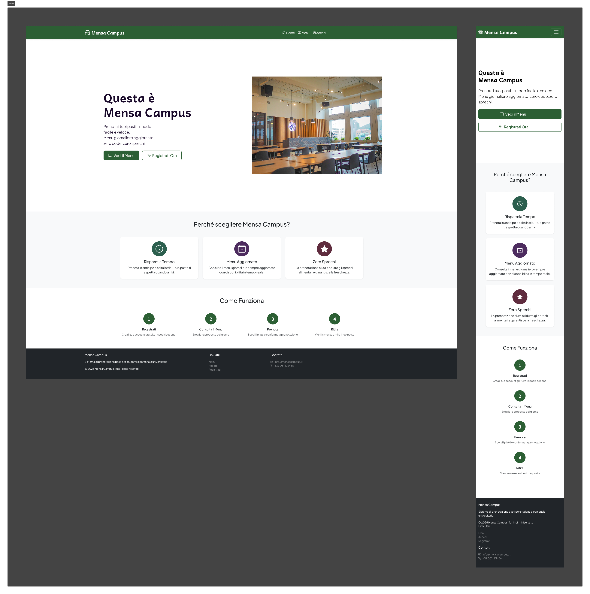
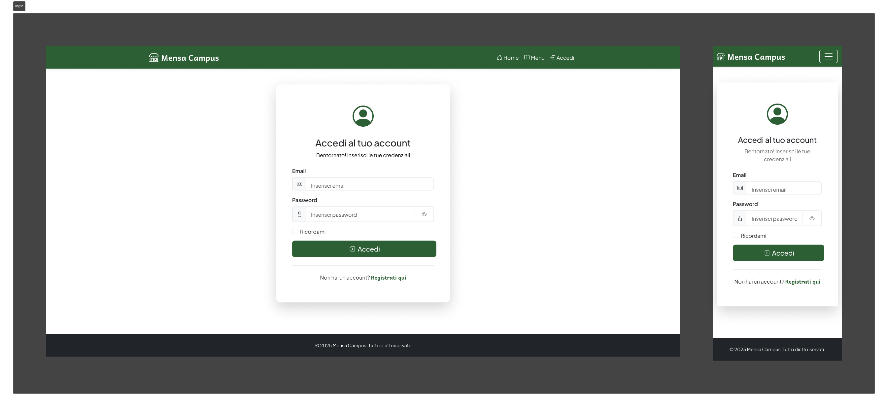
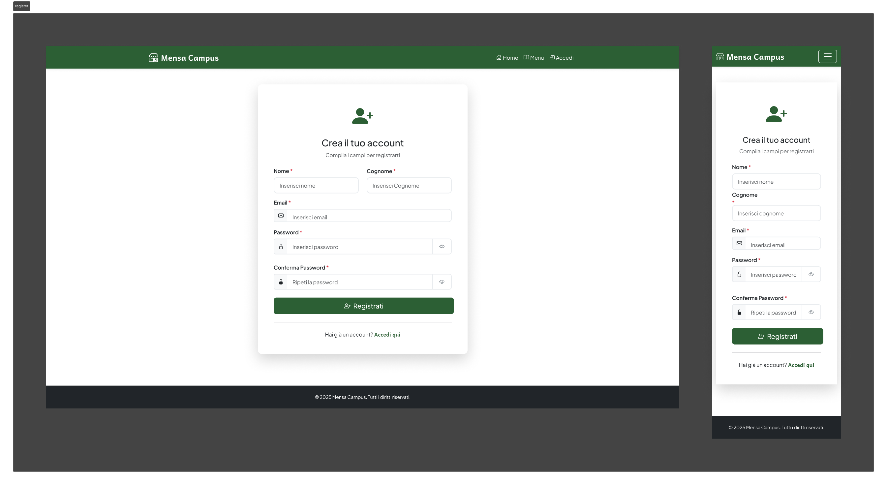
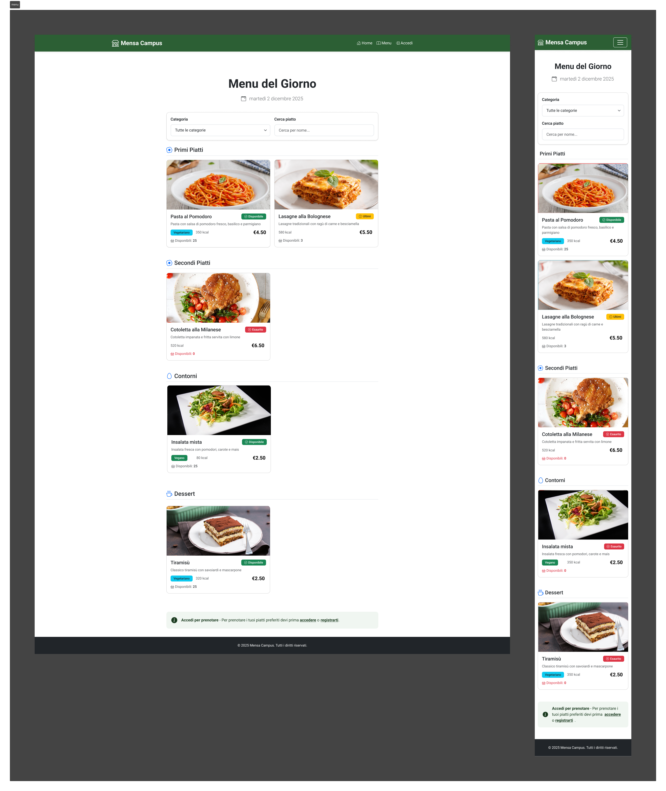
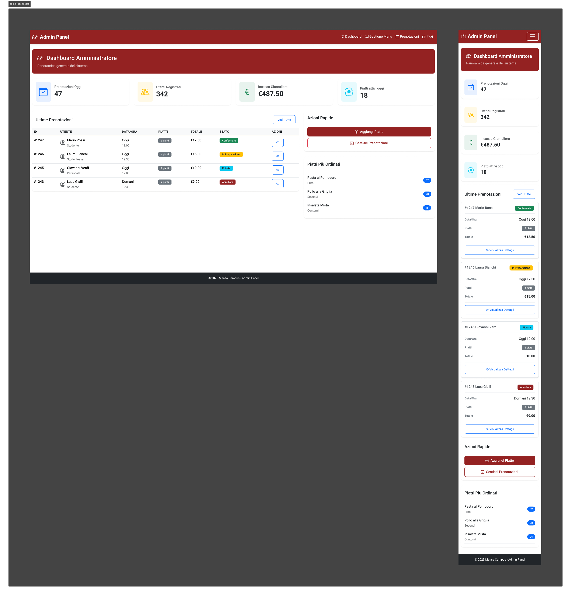
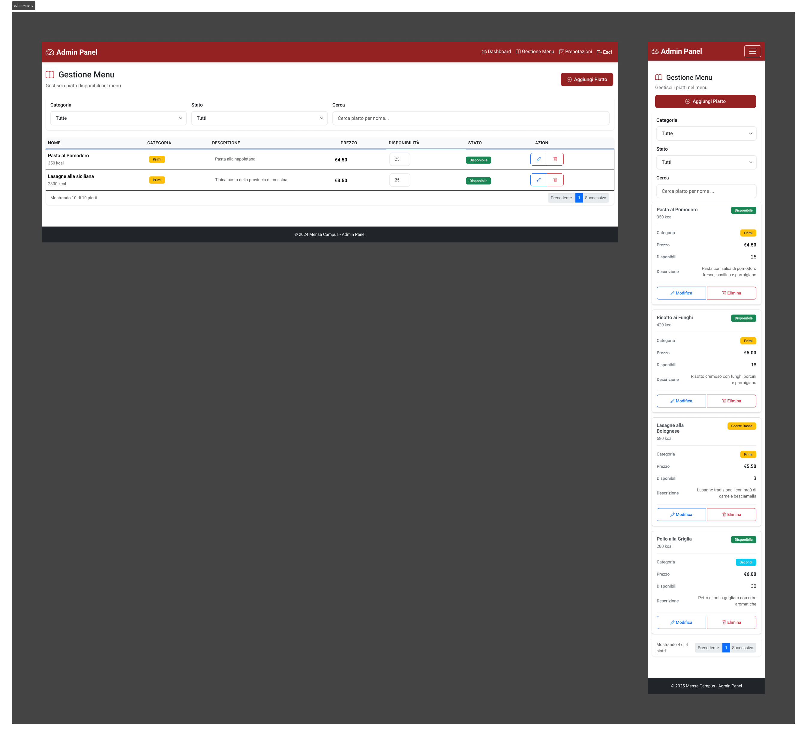
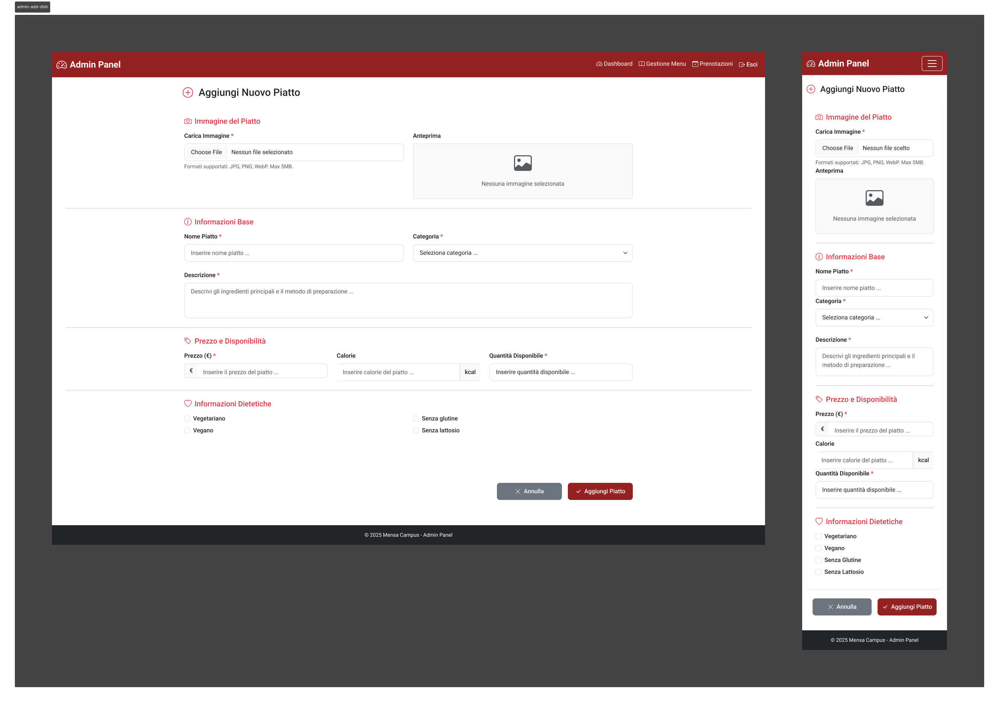
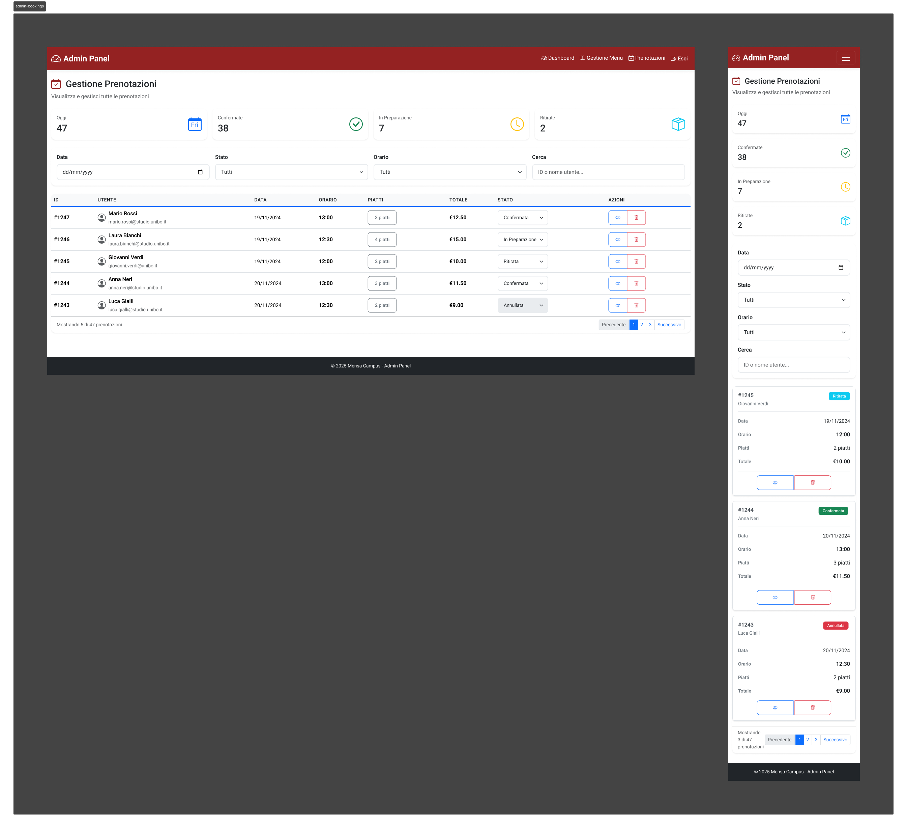

# Report Progetto di Tecnologie Web  
_Sistema di Prenotazione Pasti Universitari – Mensa Campus_

## 1 Introduzione

### 1.1 Obiettivo del Progetto
**Mensa Campus** è un'applicazione web sviluppata per gestire le prenotazioni dei pasti presso una mensa universitaria. Il sistema permette agli studenti di consultare il menù giornaliero, effettuare prenotazioni con specifici orari, e agli amministratori di gestire i piatti disponibili e monitorare le prenotazioni.

### 1.2 Contesto e Motivazioni
Il progetto nasce dall'esigenza di digitalizzare e ottimizzare il processo di prenotazione dei pasti in una mensa universitaria, riducendo i tempi di attesa, migliorando l'esperienza utente e facilitando la gestione operativa per il personale amministrativo.

## 2 Analisi dei Requisiti

### 2.1 Requisiti Funzionali

#### **Utente Standard**
- Registrazione e login al sistema
- Visualizzazione menù giornaliero con dettagli (nome, descrizione, prezzo, calorie, categoria)
- Prenotazione pasti con selezione di data/ora e quantità
- Gestione profilo personale (modifica dati, preferenze dietetiche)
- Visualizzazione storico prenotazioni con stati
- Possibilità di aggiungere note alle prenotazioni

#### **Utente Amministratore**
- Accesso a tutte le funzionalità utente standard
- Aggiunta nuovi piatti con caricamento immagini
- Gestione categorie e specifiche dietetiche
- Monitoraggio prenotazioni
- Gestione stock piatti disponibili

#### **Sistema**
- Gestione automatica degli slot temporali (11:30-15:45, intervalli 15 minuti)
- Aggiornamento automatico degli slot futuri (finestra mobile di 14 giorni)
- Controllo disponibilità e gestione giacenze
- Stati prenotazione: "Da Visualizzare", "In Preparazione", "Pronto al ritiro", "Completato", "Annullato"

### 2.2 Requisiti Non Funzionali
- **Usabilità**: Interfaccia responsive, navigazione intuitiva
- **Performance**: Gestione efficiente delle query con prepared statements
- **Manutenibilità**: Codice modulare con separazione template/logica
- **Compatibilità**: Browser moderni, dispositivi mobile e desktop

## 3. Casi D'uso

Il progetto include un diagramma UML dei casi d'uso che mostra le interazioni tra attori (Utente, Amministratore) e sistema.

**Attori**:
- **Utente Studente**: Visualizza menù, prenota, gestisce profilo
- **Amministratore**: Gestisce piatti, categorie, monitora prenotazioni

**Casi d'uso principali**:
- Registrazione/Login
- Visualizzazione Menù
- Effettua Prenotazione
- Gestione Profilo
- [Admin] Aggiunta Piatto
- [Admin] Gestione Prenotazioni

## 4 Mockup e Design dell'Interfaccia

Nelle fasi iniziali del progetto, dopo aver definito le personas e i principali casi d’uso, sono stati realizzati dei mockup delle pagine principali utilizzando Figma, al fine di validare la struttura dell’interfaccia e il flusso di navigazione prima dell’implementazione.

### 4.1 Pagine Utente

#### Homepage

*Pagina iniziale con presentazione del servizio e pulsanti per registrazione/login*

#### Login

*Form di accesso per utenti registrati*

#### Registrazione

*Form di registrazione per nuovi utenti con campi per email, password, nome e cognome*

#### Menù

*Visualizzazione dei piatti disponibili organizzati per categorie con immagini, descrizioni e prezzi*

#### Dashboard Utente

*Pannello principale dell'utente con riepilogo prenotazioni e accesso rapido alle funzionalità*

#### Prenotazioni

*Interfaccia per effettuare nuove prenotazioni con selezione data, ora e piatti*

#### Profilo Utente

*Pagina di gestione dati personali e preferenze dietetiche*

### 4.2 Pagine Amministratore

#### Dashboard Admin

*Pannello di controllo amministrativo con statistiche e accesso alle funzionalità di gestione*

#### Menù Admin

*Gestione completa del menù con possibilità di modifica ed eliminazione piatti*

#### Aggiungi Piatto

*Form per l'inserimento di nuovi piatti con upload immagine, dettagli nutrizionali e categorie*

#### Gestione Prenotazioni

*Visualizzazione e gestione di tutte le prenotazioni degli utenti con cambio stato*

## 5 Tecnologie Utilizzate

### 5.1 Tecnologie Backend
- **PHP**: Linguaggio server-side principale
- **MySQL**: Sistema di gestione database relazionale
- **MySQLi**: Libreria PHP per interfaccia database

### 5.2 Tecnologie Frontend
- **HTML5**: Struttura semantica delle pagine
- **CSS3**: Stilizzazione custom (user-style.css, admin-style.css)
- **JavaScript**: Interattività client-side

### 5.3 Ambiente di Sviluppo
- **XAMPP**: Stack di sviluppo (Apache, MySQL, PHP)

## 6 Database
### 6.1 Diagramma ER

## 7 Deployment e Configurazione

### 7.1 Credenziali Default

| Ruolo           | Email                     | Password    |
|-----------------|---------------------------|------------|
| **Admin**       | `admin@mensa.it`          | `admin123` |
| **Utente Test** | `mario.rossi@studenti.it`| `mario123` |
