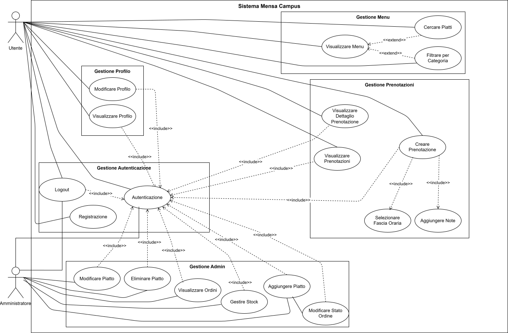
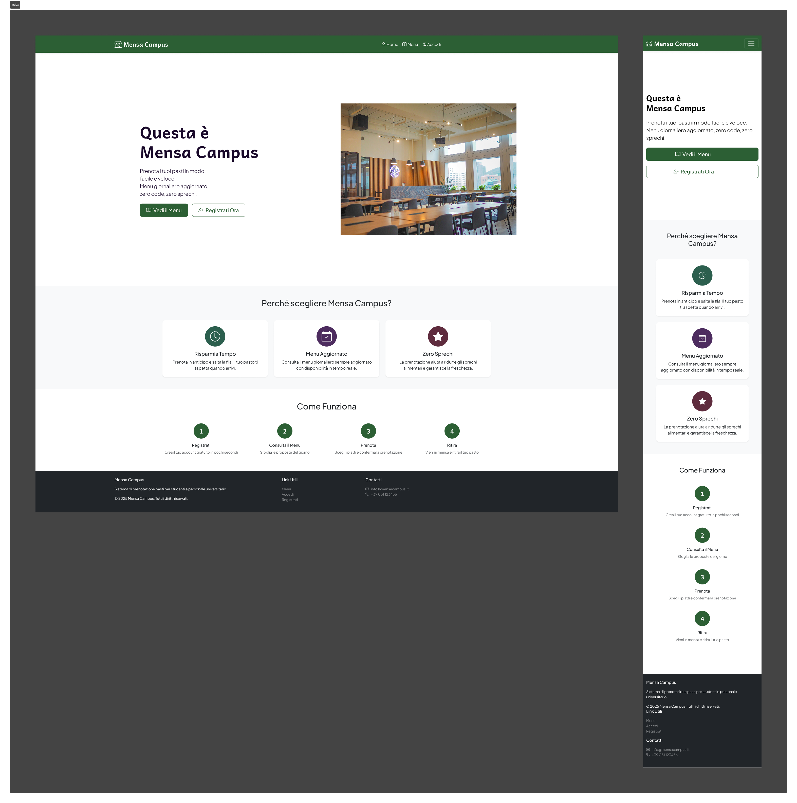
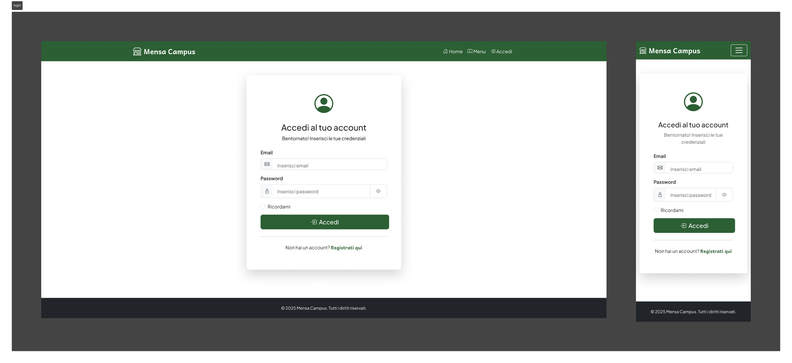
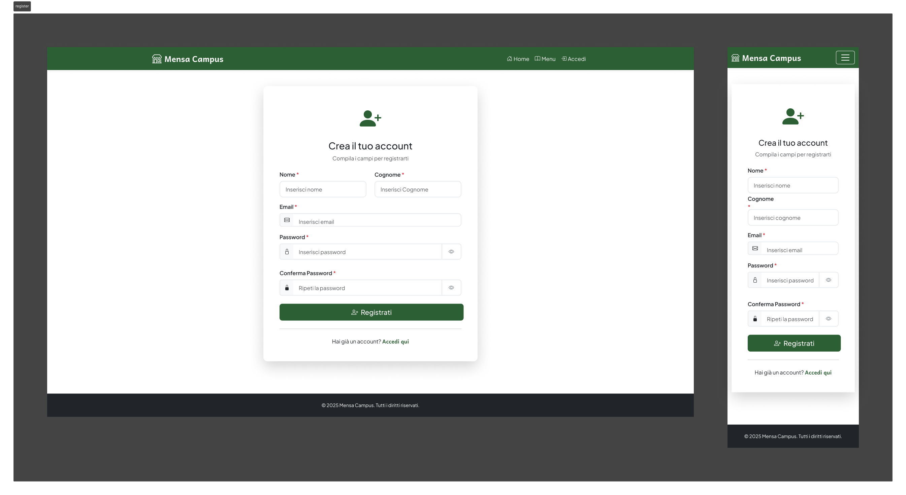
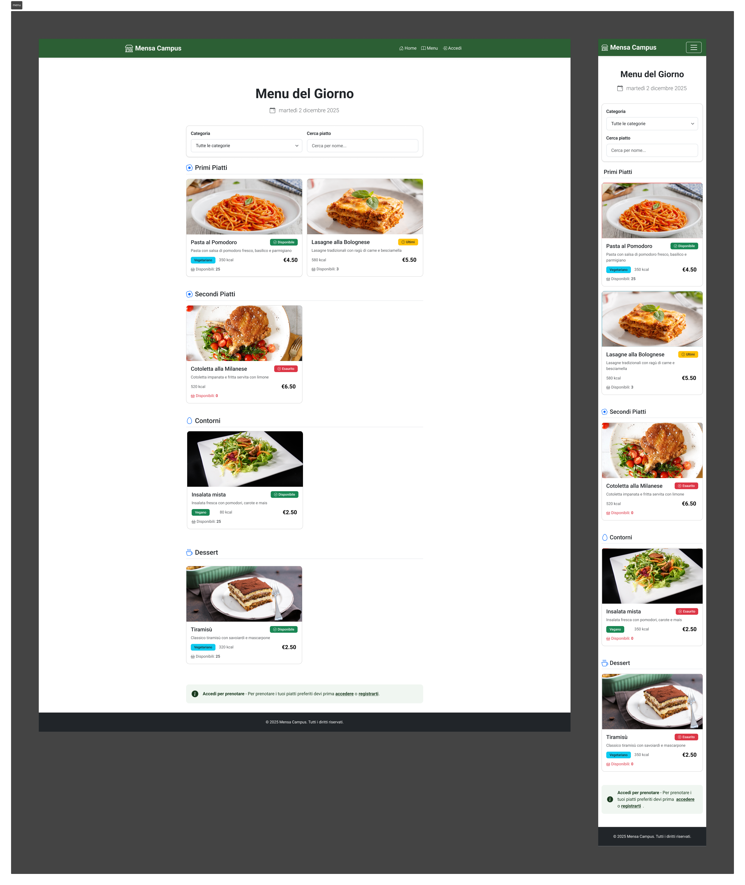
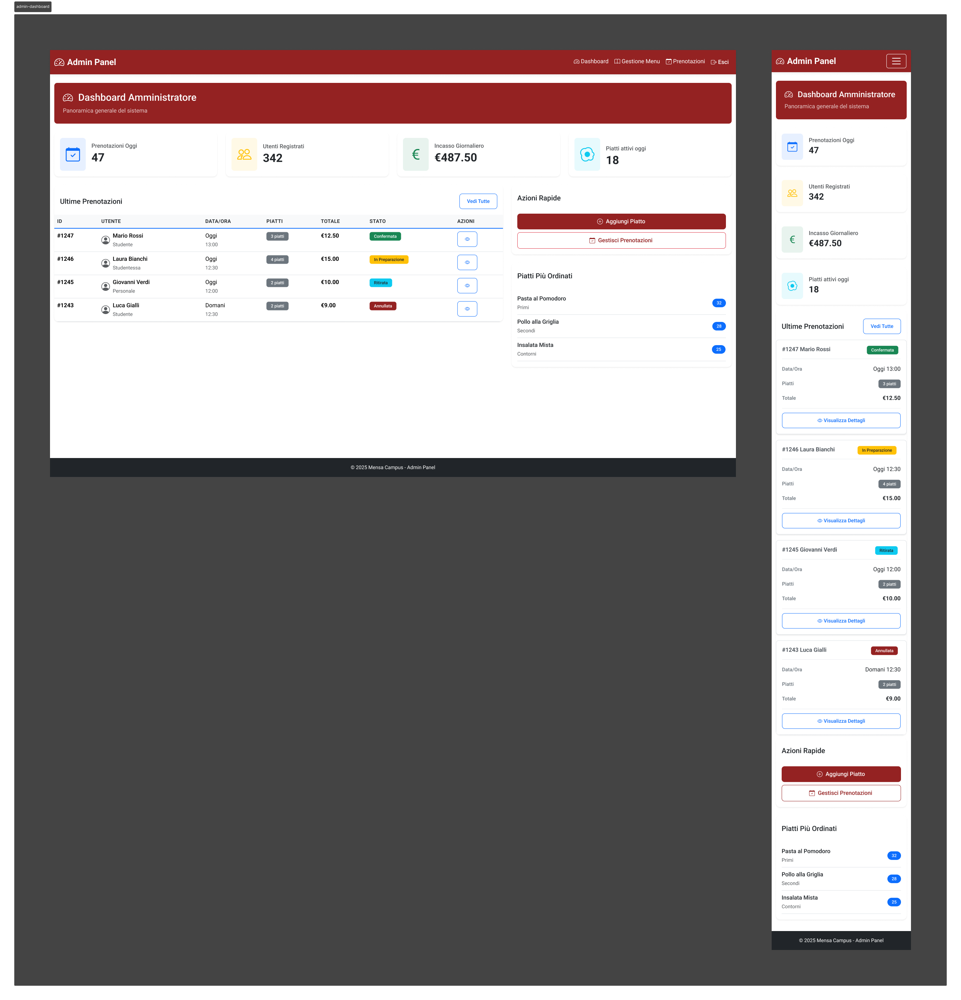
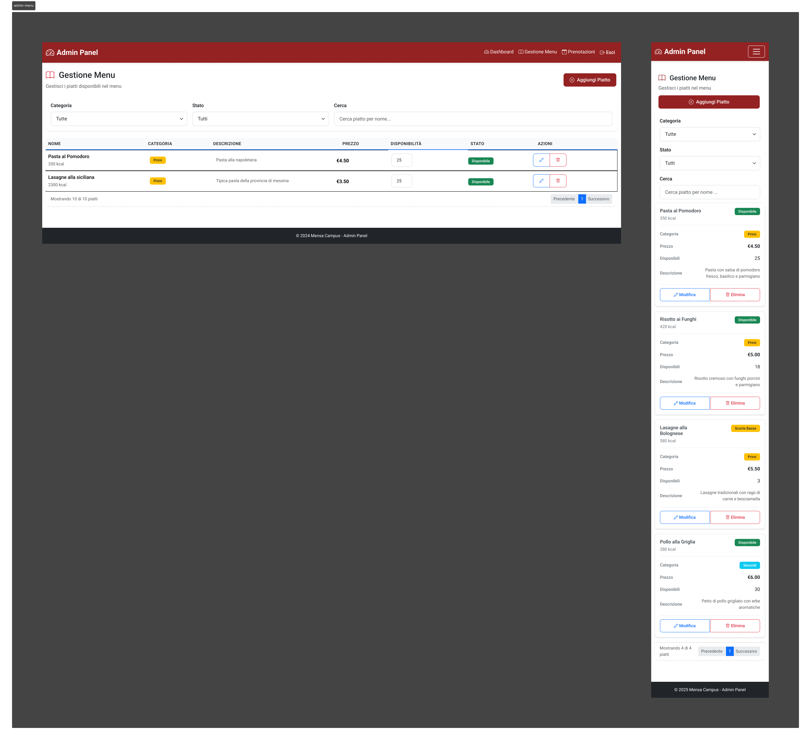
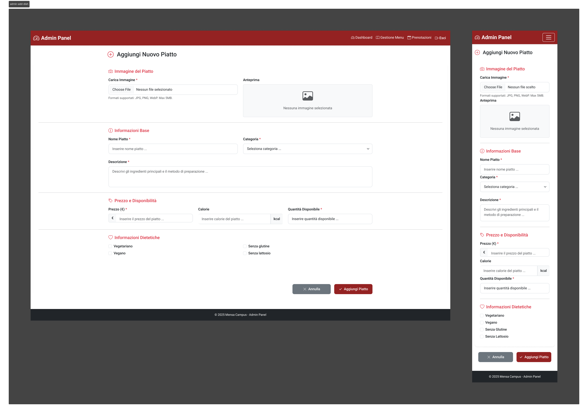
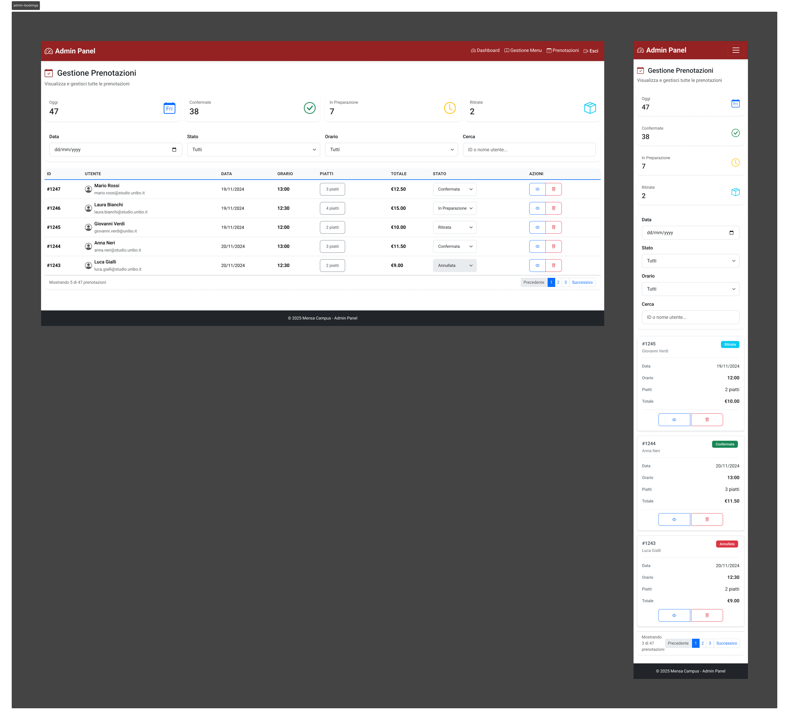

# Report Progetto di Tecnologie Web  
_Sistema di Prenotazione Pasti Universitari – Mensa Campus_

## 1 Introduzione

### 1.1 Obiettivo del Progetto
**Mensa Campus** è un'applicazione web sviluppata come prototipo per la gestione delle prenotazioni dei pasti presso una mensa universitaria.

### 1.2 Contesto e Motivazioni
Il progetto nasce dalla constatazione che nel campus universitario di Cesena non è attualmente presente un servizio di mensa. Questa mancanza rappresenta un limite per molti studenti, che spesso devono organizzarsi autonomamente per i pasti durante le giornate di lezione.
Per confermare questa esigenza, è stata condotta un’indagine informale coinvolgendo studenti del campus di Cesena e il profilo social “Spotted” ufficiale. Dalle risposte raccolte è emersa con particolare frequenza la richiesta di un servizio di mensa universitaria.
Alla luce di questi risultati, il progetto Mensa Campus è stato concepito come esercizio progettuale e tecnologico volto a simulare un sistema completo di prenotazione e gestione dei pasti, ipotizzando l’introduzione futura di una mensa universitaria nel campus.

## 2 Analisi dei Requisiti
I requisiti del sistema sono stati definiti a partire da un confronto diretto con studenti universitari del campus di Cesena. Attraverso domande informali rivolte a colleghi e amici, sono state raccolte indicazioni sulle funzionalità ritenute più utili per un ipotetico servizio di mensa universitaria. Le risposte ottenute hanno guidato la definizione delle principali caratteristiche dell’applicazione, con particolare attenzione alla semplicità di utilizzo, alla gestione delle prenotazioni e alla chiarezza delle informazioni fornite.

### 2.1 Requisiti Funzionali

**Utente Standard:**
- Registrazione e login con validazione email
- Visualizzazione menù organizzato per categorie
- Prenotazione pasti con selezione data/ora e quantità piatti
- Gestione profilo
- Storico prenotazioni con stati aggiornati in tempo reale
- Aggiunta note alle prenotazioni
- Carrello dinamico con calcolo totale
- Paginazione menù e ricerca con filtri

**Amministratore:**
- Visualizzazione dashboard amminatrativa
- Aggiunta/modifica piatti con caricamento immagini
- Gestione categorie e specifiche dietetiche (vegano, senza glutine, ecc.)
- Monitoraggio prenotazioni con ricerca e filtri
- Gestione stock e disponibilità piatti
- Amministrazione slot temporali
- Gestione prenotazioni (modifica stato, cancellazione)

### 2.2 Requisiti Non Funzionali
- **Usabilità**: Interfaccia responsive, navigazione intuitiva
- **Performance**: Gestione efficiente delle query con prepared statements
- **Manutenibilità**: Codice modulare con separazione template/logica

## 3. Casi D'uso

Il progetto include un diagramma UML dei casi d'uso che mostra le interazioni tra attori (Utente, Amministratore) e sistema.

**Attori**:
- **Utente**: Studenti e personale universitario che prenotano pasti
- **Amministratore**: Il personale di gestione della mensa

## 4 Mockup e Design dell'Interfaccia

Nelle fasi iniziali del progetto, dopo aver definito le personas e i principali casi d’uso, sono stati realizzati dei mockup delle pagine principali utilizzando Figma, al fine di validare la struttura dell’interfaccia e il flusso di navigazione prima dell’implementazione.

### 4.1 Pagine Utente

#### Homepage

*Pagina iniziale con presentazione del servizio e pulsanti per registrazione/login*

#### Login

*Form di accesso per utenti registrati*

#### Registrazione

*Form di registrazione per nuovi utenti con campi per email, password, nome e cognome*

#### Menù

*Visualizzazione dei piatti disponibili organizzati per categorie con immagini, descrizioni e prezzi*

#### Dashboard Utente

*Pannello principale dell'utente con riepilogo prenotazioni e accesso rapido alle funzionalità*

#### Prenotazioni

*Interfaccia per effettuare nuove prenotazioni con selezione data, ora e piatti*

#### Profilo Utente

*Pagina di gestione dati personali e preferenze dietetiche*

### 4.2 Pagine Amministratore

#### Dashboard Admin

*Pannello di controllo amministrativo con statistiche e accesso alle funzionalità di gestione*

#### Menù Admin

*Visualizzazione dei piatti disponibili con possibilià di ricerca*

#### Aggiungi Piatto

*Form per l'inserimento di nuovi piatti con upload immagine, dettagli nutrizionali e categorie*

#### Modifica Piatto
*Form dedicato alla modifica dei dati di un piatto esistente, inclusi immagine, prezzo, informazioni nutrizionali e categoria.*

#### Gestione slot
*Pagina dedicata alla gestione degli slot orari in cui prenotare i pasti*

#### Gestione Prenotazioni

*Visualizzazione e gestione di tutte le prenotazioni degli utenti con possibilità di ricerca*

#### Modifica Stato Prenotazioni
*Visualizzazione dei dettagli di una prenotazione con cpossibilità di cambio stato*

## 5 Tecnologie Utilizzate

### 5.1 Tecnologie Backend
- **PHP**: Linguaggio server-side principale
- **MySQL**: Sistema di gestione database relazionale
- **MySQLi**: Libreria PHP per interfaccia database

### 5.2 Tecnologie Frontend
- **HTML5**: Struttura semantica delle pagine
- **CSS3**: Stilizzazione custom (user-style.css, admin-style.css)
- **Bootstrap 5**: Framework CSS per design responsive
- **JavaScript**: Interattività client-side
- **AJAX**: Aggiornamento dinamico dei contenuti tramite dati forniti da API

### 5.3 Ambiente di Sviluppo
- **XAMPP**: Stack di sviluppo (Apache, MySQL, PHP)

## 6 Database
### 6.1 Diagramma ER

## 7 Deployment e Configurazione
### 7.1 Credenziali Default

| Ruolo           | Email                     | Password    |
|-----------------|---------------------------|------------|
| **Admin**       | `admin@mensa.it`          | `admin123` |
| **Utente Test** | `mario.rossi@studenti.it`| `mario123` |

## 8 Test e Validazione con gli Utenti
### 8.1 Metodologia di Test
Al fine di valutare l’usabilità e l’efficacia del sistema Mensa Campus, è stata effettuata una fase di test informale coinvolgendo un gruppo di studenti universitari del campus di Cesena. 

Ai partecipanti è stato chiesto di utilizzare l’applicazione simulando le principali operazioni previste dal sistema, quali la consultazione del menù, l’effettuazione di più prenotazioni e la navigazione tra le diverse sezioni dell’interfaccia.

Durante i test sono stati raccolti feedback relativi alla chiarezza dell’interfaccia, alla semplicità di utilizzo e alla comprensione del flusso di prenotazione. 

I risultati ottenuti dai tester hanno permesso di individuare alcuni aspetti migliorabili non evidenziati nelle precedenti fasi di progettazione, portando a piccole modifiche nell’interfaccia utente e nel flusso di navigazione per renderli più intuitivi.

### 8.2 Cambiamenti Apportati dopo i Test
#### Lato Utente
- Migliorata la visibilità dei pulsanti di azione principali e la loro disposizione.
- Aggiunta la possibilità di inserire la quantità di piatti da ordinare.

#### Lato Amministratore
- Ottimizzata la gestione delle prenotazioni con filtri più intuitivi.
- Uniformata la grafica delle pagine di amministrazione per una migliore coerenza visiva tra desktop e mobile.